<h1 align="center">Hi 👋, I'm Naman Srivastava</h1>
<h3 align="center">Backend-Focused Full-Stack Developer building scalable APIs, real-time systems & production-ready applications</h3>

## 💫 About Me

* 🔧 I design and build **scalable backend systems and real-time applications** with a strong focus on **performance, reliability, and clean architecture**
* 🧠 Currently deepening my expertise in **system design, database optimization, distributed systems, and backend architecture**
* 🚀 **Core Stack:** Node.js, Express.js, TypeScript, MongoDB
* 🌐 **Frontend:** React, Next.js
* 🔌 **APIs & Real-Time:** REST APIs, WebSockets, Socket.io
* ☁️ **Cloud & Deployment:** AWS, Vercel, Render
* ⚙️ Experienced in building **authentication systems, payment integrations, role-based systems, and real-time features**
* 🏗️ I enjoy working on systems where **architecture, scalability, and reliability** matter just as much as getting the feature to work
* 💬 Ask me about **backend architecture, API design, system design, debugging, or turning complex ideas into production-ready systems**
* ⚡ Fun fact: I've lost track of time more than once fixing something that *"should've taken 5 minutes"*
* 📫 Reach me at: **[srinaman05@gmail.com](mailto:srinaman05@gmail.com)**

## 🌐 Connect With Me

## 💻 Tech Stack

### Languages

### Backend & APIs

### Frontend

### Cloud & Deployment

## 📊 GitHub Stats

  
   
  

  

### ✍️ Random Dev Quote

---

<!-- Profile stats are generated automatically using GitHub Actions -->
